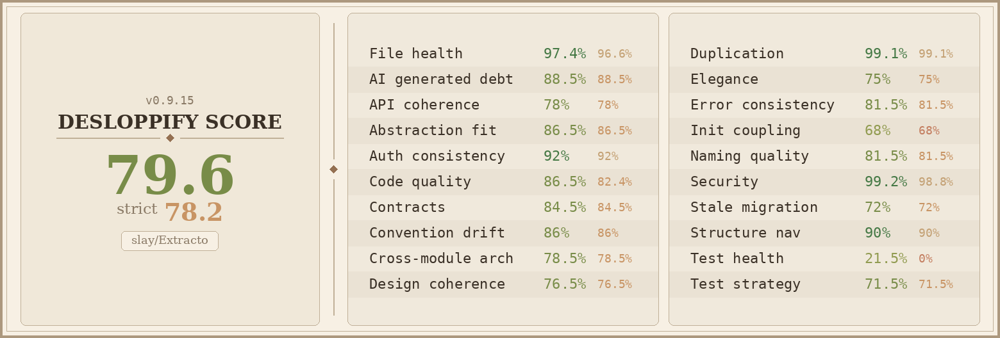

<p align="center">
  
</p>

<p align="center">
  <strong>Self-hosted OCR for documents.</strong><br/>
  Pick your model, drop in a PDF or photo, get clean text out.
</p>

<p align="center">
  <a href="#install-in-2-minutes">Install</a> ·
  <a href="#what-it-does">What it does</a> ·
  <a href="#run-it-as-an-api">API mode</a> ·
  <a href="#use-it-from-an-agent">Agents &amp; CLI</a> ·
  <a href="#configuration">Configuration</a>
</p>

---

## What it does

You give Extracto a PDF, an image, or a folder of them. It runs OCR with the model of your choice and gives you back clean text. That's the whole pitch.

What's actually in the box:

- **OCR with four provider families:** Ollama on your own machine (fully offline, no key needed), Mistral OCR API, OpenRouter (any vision model in their catalog), or any OpenAI-compatible endpoint (the real OpenAI, vLLM, LocalAI, llama.cpp server, Groq, Together, Fireworks, etc.).
- **Multi-page PDFs out of the box.** Each page is rendered to an image, OCR'd, and merged. No hard cap on page count.
- **Resumable jobs.** Stop a long run, come back later, hit Resume, and it picks up from the last completed page.
- **Optional post-processing pass.** After OCR, send the text through any model with your own instruction (extract invoice line items, normalize tables, return JSON, etc.).
- **Searchable history** with file preview, Markdown / Raw / JSON tabs, per-run download or delete.
- **Three vector stores for knowledge bases:** Chroma, Qdrant, Weaviate. Chunk + embed + push in one click, configurable per user.
- **Watched folders** for fire-and-forget ingestion.
- **Per-user accounts**, per-user provider settings, per-user API keys with scopes and rate limits.
- **Two surfaces:** a polished editorial web UI for humans, and a stable bearer-auth HTTP API under `/api/v1/*` for everything else.
- **Five UI languages:** English (default), Italian, French, Spanish, German.

The whole stack runs in a single Docker container. SQLite for the database, Bun for the runtime, Next.js 16 for the app.

---

## Install in 2 minutes

You need Docker. That's it.

### Linux

```bash
git clone https://github.com/codelined-ag/extracto
cd extracto
./install-extracto.sh
extracto on
```

`install-extracto.sh` installs Docker if missing, installs Ollama if missing, drops the `extracto` launcher in `~/.local/bin`, and patches your shell rc. After that:

```bash
extracto on            # build + start
extracto off           # stop
extracto status        # docker compose ps
extracto logs          # tail container logs
extracto uninstall     # full teardown
```

Open <http://localhost:3000>, sign up, you're in.

### macOS

Install [Docker Desktop](https://www.docker.com/products/docker-desktop/) and (optionally for local OCR) [Ollama](https://ollama.com/download/mac). Then:

```bash
git clone https://github.com/codelined-ag/extracto
cd extracto
mkdir -p "$HOME/.local/bin"
ln -sf "$PWD/scripts/extracto.sh" "$HOME/.local/bin/extracto"
echo 'export PATH="$HOME/.local/bin:$PATH"' >> "$HOME/.zshrc"
exec zsh
extracto on
```

### Windows

Install [Docker Desktop](https://www.docker.com/products/docker-desktop/) (WSL2 backend) and (optionally) [Ollama for Windows](https://ollama.com/download/windows). From PowerShell:

```powershell
git clone https://github.com/codelined-ag/extracto
cd extracto
.\scripts\extracto.ps1 install      # adds 'extracto' to your user PATH
extracto on
```

If PowerShell blocks the script: `Set-ExecutionPolicy -Scope CurrentUser RemoteSigned`.

### Plain Docker Compose (any OS)

```bash
git clone https://github.com/codelined-ag/extracto
cd extracto
docker compose --env-file docker.env up -d --build
docker compose logs -f app
```

The container generates a strong `AUTH_SECRET` on first boot and writes it to `/app/data/.auth_secret` (or you can set your own in `docker.env`). Open <http://localhost:3000>.

---

## How to use it (the UI)

Once you're signed in:

1. **Configure a provider** (top-right gear → Provider). Pick Ollama / Mistral / OpenRouter / OpenAI-compatible, paste an endpoint and key. Hit Save.
2. **Pick a model** (gear → Model). The picker is searchable and refreshes from the live provider catalog. For Ollama, it lists every model you've pulled. For OpenRouter, it lists every model in the catalog (including vision-capable ones).
3. **Tweak Advanced Options** in the sidebar (language, table detection, handwriting, formatting, quality, custom prompt, optional post-processing pass).
4. **Drag in a file** (or click the dropzone). PDFs, PNGs, JPEGs, WebPs.
5. **Hit Run OCR.** Watch progress page-by-page in the live activity panel.
6. **Read the result** in the right pane (Markdown / Markdown raw / JSON tabs). Use the **Actions** dropdown to copy, download, or send to your vector store.
7. **Stop / Resume.** Long jobs can be paused; they resume from the last completed page.
8. **Browse history** via the History tile in the sidebar. Search, filter by status, view, re-download, delete.

---

## Run it as an API

Extracto is a real OCR service, not just a UI. The same backend powers the browser and a stable bearer-auth HTTP API under `/api/v1/*`.

### 1. Mint an API key

Either from the running container CLI:

```bash
extracto api-key create user@example.com "ci-runner"
# Default: scope "*" (everything), default rate limit
```

Or scoped:

```bash
extracto api-key create user@example.com "batch-runner" \
  --scopes=ocr:submit,ocr:read --rate-limit=30
```

Or from an authenticated browser session via `POST /api/v1/keys`. The key is shown plaintext exactly once — copy it then.

**Available scopes:** `*`, `ocr:submit`, `ocr:read`, `ocr:control`, `settings:read`, `settings:write`, `webhooks:read`, `webhooks:write`, `presets:read`, `presets:write`, `search:read`.

API keys cannot mint or revoke other keys. That path is session-only so a leaked key has bounded blast radius.

### 2. Submit an OCR job

```bash
curl -X POST http://localhost:3000/api/v1/ocr/batch \
  -H "Authorization: Bearer $EXTRACTO_API_KEY" \
  -H "Content-Type: application/json" \
  -d '{
    "files": [
      {"fileName": "invoice.pdf", "preview": "data:application/pdf;base64,JVBERi0...", "model": "mistral-ocr-latest"}
    ]
  }'
# → { "batchId": "batch_...", "submissions": [{ "fileName":"invoice.pdf", "jobId":"..." }] }
```

### 3. Stream or poll until done

```bash
# Stream
curl -N -H "Authorization: Bearer $EXTRACTO_API_KEY" \
  http://localhost:3000/api/jobs/$JOB_ID/stream
# event: progress / event: done

# Or poll
curl -s -H "Authorization: Bearer $EXTRACTO_API_KEY" \
  http://localhost:3000/api/jobs/$JOB_ID
# → { "job": { "status": "COMPLETED", "extractedText": "...", "result": {...} } }
```

### 4. Drop-in OpenAI replacement

If you already have OpenAI-SDK code that does vision OCR, point its base URL at Extracto:

```bash
curl -X POST http://localhost:3000/api/v1/openai/chat/completions \
  -H "Authorization: Bearer $EXTRACTO_API_KEY" \
  -H "Content-Type: application/json" \
  -d '{
    "model": "anthropic/claude-3.5-sonnet",
    "messages": [{
      "role": "user",
      "content": [
        {"type": "text", "text": "Extract all line items as a markdown table."},
        {"type": "image_url", "image_url": {"url": "data:image/png;base64,..."}}
      ]
    }]
  }'
```

The adapter blocks until the OCR job completes (up to 5 minutes) and returns the standard OpenAI Chat Completions shape.

### 5. Subscribe to events with webhooks

```bash
curl -X POST http://localhost:3000/api/v1/webhooks \
  -H "Authorization: Bearer $EXTRACTO_API_KEY" \
  -d '{"url": "https://your-app.example/extracto-hook", "events": ["job.completed"]}'
# → { "webhook": { "id":..., "secret":"whsec_..." } }
```

Each delivery carries an `X-Extracto-Signature: t=<unix-ts>,v1=<hex>` HMAC-SHA256 header signing `${ts}.${body}`. Webhook URLs are validated against the `WEBHOOK_ALLOWED_HOSTS` allowlist; private, loopback, link-local, and CGNAT addresses are rejected unconditionally.

### Endpoint reference

| Endpoint | Methods | Auth | Required scope |
|---|---|---|---|
| `/api/health` | GET | public | — |
| `/api/auth/*` | POST/GET | session only | — |
| `/api/v1/keys` | GET, POST | session only | — |
| `/api/v1/keys/:id` | DELETE | session only | — |
| `/api/v1/ocr/batch` | POST | session or Bearer | `ocr:submit` |
| `/api/v1/openai/chat/completions` | POST | session or Bearer | `ocr:submit` |
| `/api/v1/webhooks` | GET, POST | session or Bearer | `webhooks:read` / `webhooks:write` |
| `/api/v1/webhooks/:id` | PATCH, DELETE | session or Bearer | `webhooks:write` |
| `/api/v1/presets` | GET, POST | session or Bearer | `presets:read` / `presets:write` |
| `/api/v1/presets/:id` | PATCH, DELETE | session or Bearer | `presets:write` |
| `/api/v1/search` | GET | session or Bearer | `search:read` |
| `/api/v1/export/kb` | POST | Bearer | `ocr:read` |
| `/api/v1/metrics` | GET | `METRICS_TOKEN` | — |
| `/api/jobs` | GET, DELETE | session or Bearer | `ocr:read` / `ocr:control` |
| `/api/jobs/:id` | GET, DELETE | session or Bearer | `ocr:read` / `ocr:control` |
| `/api/jobs/:id/stream` | GET (SSE) | session or Bearer | `ocr:read` |
| `/api/jobs/:id/control` | POST | session or Bearer | `ocr:control` |
| `/api/ocr` | GET, POST | session or Bearer | `ocr:read` / `ocr:submit` |
| `/api/models` | GET | session or Bearer | `ocr:read` |
| `/api/settings` | GET, POST | session or Bearer | `settings:read` / `settings:write` |
| `/api/ocr/settings` | GET, PUT | session or Bearer | `settings:read` / `settings:write` |
| `/api/kb/defaults` | GET, PUT | session or Bearer | `settings:read` / `settings:write` |
| `/api/kb/export` | POST | session | `ocr:read` |

`/api/*` is the browser-internal surface (no version contract). `/api/v1/*` is the stable API (semver, no breaking changes within v1).

---

## Use it from an agent

Extracto ships with two affordances designed for LLM agents and scripted clients.

### The `extracto` CLI

The same binary used for lifecycle (`extracto on / off`) is also a typed wrapper around the HTTP API. Set `EXTRACTO_TOKEN` (or `~/.extracto/config` with `EXTRACTO_TOKEN=...`) and you're done:

```bash
# Single-file OCR — submits, waits, prints the final job JSON
extracto ocr ./invoice.pdf --model mistral-ocr-latest

# Save instead of print
extracto ocr ./invoice.pdf --model qwen2-vl-7b --out result.json

# Don't wait — return as soon as queued
extracto ocr ./big.pdf --model minicpm-v --no-wait

# Job management
extracto jobs list
extracto jobs get <id>
extracto jobs wait <id>
extracto jobs cancel <id>
extracto jobs delete <id>

# Output presets (post-processing recipes)
extracto presets list
extracto presets create "Invoice → JSON" "Extract line items as JSON" json
extracto presets delete <id>

# Knowledge-base export
extracto kb export <job-id> \
  --collection my-docs \
  --store-url http://chroma:8000 \
  --embed-model nomic-embed-text \
  --strategy paragraph \
  --chunk-size 1200

# Provider settings (read-only from CLI; change in the UI)
extracto settings get
```

`extracto ocr` accepts `.pdf`, `.png`, `.jpg`/`.jpeg`, `.webp` up to ~32 MiB. It base64-encodes and submits via `/api/v1/ocr/batch`, then polls until the job leaves `QUEUED`/`PROCESSING`. Errors print to stderr with non-zero exit codes.

The CLI lives at `scripts/extracto.sh` (Bash, Linux + macOS) and `scripts/extracto.ps1` (PowerShell, Windows).

### The agent skill

`SKILL.md` in the repo root is a **Claude Skill** (also usable by any agent that follows the skills format). It documents:

- When to invoke the skill (PDF/image OCR, job management, presets).
- Which CLI commands map to which workflows.
- The expected token/URL setup.
- The output JSON shape.
- When NOT to use it (the user wants the UI; the file is too big; etc.).

Drop it into your agent's skills directory or load it directly into the agent's context. The skill assumes the container is up and an `EXTRACTO_TOKEN` is reachable in the environment.

### From plain Python / Node

Both surfaces are stable HTTP, so you can skip the CLI:

```python
import base64, requests, time

with open("invoice.pdf", "rb") as f:
    data_url = "data:application/pdf;base64," + base64.b64encode(f.read()).decode()

r = requests.post(
    "http://localhost:3000/api/v1/ocr/batch",
    headers={"Authorization": f"Bearer {TOKEN}"},
    json={"files": [{"fileName": "invoice.pdf", "preview": data_url, "model": "mistral-ocr-latest"}]},
)
job_id = r.json()["submissions"][0]["jobId"]

while True:
    job = requests.get(f"http://localhost:3000/api/jobs/{job_id}",
                       headers={"Authorization": f"Bearer {TOKEN}"}).json()["job"]
    if job["status"] in ("COMPLETED", "FAILED"):
        print(job["extractedText"])
        break
    time.sleep(2)
```

---

## Configuration

Everything lives in `docker.env`. The defaults work out of the box; tune what you need.

### Auth + sessions

| Variable | Default | What it does |
|---|---|---|
| `AUTH_SECRET` | auto-generated | HMAC secret for session cookies and API-key hashing. **Rotating invalidates every existing API key.** |
| `COOKIE_SECURE` | `false` | Set to `true` behind HTTPS. |
| `ALLOW_SIGNUP` | `1` | Set to `0` for invite-only instances; UI still works, but `POST /api/auth/signup` returns 403. |

### Networking

| Variable | Default | What it does |
|---|---|---|
| `APP_NETWORK_MODE` | `host` | `host` for the simplest Ollama setup; `bridge` for isolation. Switches how loopback Ollama URLs get rewritten inside the container. |
| `OLLAMA_HOST` | `http://127.0.0.1:11434` | Ollama base URL. With bridge mode, use `http://host.docker.internal:11434`. |
| `OLLAMA_HOST_FALLBACKS` | — | Comma-separated extra candidates to try if the primary fails. |

### Provider defaults + allowlists

Per-user provider settings always win. These values are fallbacks (when no user has saved a key) and security allowlists for user-submitted endpoints.

| Variable | Default | What it does |
|---|---|---|
| `OPENROUTER_API_URL` | `https://openrouter.ai/api/v1` | Override OpenRouter base URL. |
| `OPENROUTER_API_KEY` | — | Server-wide fallback OpenRouter key. **Leaks operator quota across users.** |
| `OPENROUTER_REFERER` / `OPENROUTER_TITLE` | — | `HTTP-Referer` / `X-Title` for OpenRouter analytics. |
| `OPENROUTER_MODELS` | — | Comma-separated fallback model list when discovery fails. |
| `OPENAI_COMPAT_API_URL` | `https://api.openai.com/v1` | Default OpenAI-compatible base URL placeholder. |
| `OPENAI_COMPAT_API_KEY` | — | Server-wide fallback OpenAI-compat key. Same caveat as OpenRouter. |
| `OPENAI_COMPAT_MODELS` | — | Fallback model list when `/models` discovery fails (some servers don't expose it). |
| `OLLAMA_ALLOWED_HOSTS` | localhost + docker gateways | Allowlist for user-submitted Ollama endpoints. Add hosts to authorize a remote Ollama instance. |
| `MISTRAL_ALLOWED_HOSTS` | `api.mistral.ai`, `*.mistral.ai` | Allowlist for Mistral endpoints. |
| `OPENROUTER_ALLOWED_HOSTS` | `openrouter.ai`, `*.openrouter.ai` | Allowlist for OpenRouter endpoints. |
| `OPENAI_COMPAT_ALLOWED_HOSTS` | `api.openai.com`, `*.openai.com` | **Extend this** to authorize self-hosted vLLM / LocalAI / Groq / Together / Fireworks endpoints. Comma-separated, leading `.` for subdomain wildcards. |

### Knowledge-base export

| Variable | Default | What it does |
|---|---|---|
| `KB_EXPORT_ENABLED` | `0` | Gate on `POST /api/kb/export` and `POST /api/v1/export/kb`. Flip to `1` to enable. |

### Webhooks

| Variable | Default | What it does |
|---|---|---|
| `WEBHOOK_ALLOWED_HOSTS` | — | Comma-separated allowlist for outgoing webhook URLs. Empty = any public host (private/loopback/link-local always rejected). |

### Object storage (optional)

For large workloads, offload result blobs to S3 or MinIO. When set, `extractedText` and `result` JSON are uploaded to S3 and the DB stores an `s3://...` reference. Reads are transparent.

| Variable | Default | What it does |
|---|---|---|
| `RESULT_STORAGE` | `local` | Set to `s3` to enable. |
| `S3_BUCKET` | — | Bucket name. |
| `S3_REGION` | — | AWS region (or any value for MinIO). |
| `S3_ENDPOINT` | — | `https://s3.amazonaws.com` for AWS, `http://minio:9000` for MinIO. |
| `S3_ACCESS_KEY_ID` / `S3_SECRET_ACCESS_KEY` | — | Credentials. |
| `S3_PREFIX` | `extracto` | Key prefix. |
| `S3_FORCE_PATH_STYLE` | `false` | Set `true` for MinIO. |

### Service-mode operations

| Variable | Default | What it does |
|---|---|---|
| `OCR_WORKER_CONCURRENCY` | `2` | Max simultaneous OCR jobs. |
| `RETAIN_JOBS_DAYS` | `0` (off) | Days before a completed job is swept (DB row + S3 artifacts). |
| `METRICS_TOKEN` | — | Bearer token for `/api/v1/metrics` (Prometheus exposition). Endpoint returns 503 if unset. |

### Watched-folder ingestion

Drop files into a host-mounted directory and have them auto-OCR'd. A `.extracto.done` sidecar marks each completed file. Watched-folder jobs run at priority `-2` so interactive submissions cut ahead.

| Variable | Default | What it does |
|---|---|---|
| `WATCH_FOLDER` | — | Path inside the container (mount it from host). |
| `WATCH_FOLDER_USER_EMAIL` | — | The user who owns the resulting jobs. |
| `WATCH_FOLDER_API_KEY` | — | A real API key minted for that user. |
| `WATCH_FOLDER_MODEL` | — | Model ID. |
| `WATCH_FOLDER_PROVIDER` | — | Optional provider override. |
| `WATCH_FOLDER_INTERVAL_MS` | `30000` | Poll interval (min 5000). |

---

## Providers

Four families, all configured per user from Settings → Provider:

| Provider | Endpoint | Key required | Model discovery |
|---|---|---|---|
| **Ollama** | local or remote `http://host:11434` | no | `GET /api/tags` (also `/v1/models`) |
| **Mistral OCR API** | `https://api.mistral.ai/v1/ocr` | yes | static catalog (override via `MISTRAL_MODELS`) |
| **OpenRouter** | `https://openrouter.ai/api/v1` | yes | live `GET /models` per user key |
| **OpenAI-compatible** | any base URL | yes | live `GET /models` per user key |

The OpenAI-compatible provider works with anything speaking the OpenAI Chat Completions wire format with vision content blocks: the real `api.openai.com`, [vLLM](https://github.com/vllm-project/vllm), [LocalAI](https://localai.io), [Groq](https://groq.com), [Together](https://together.ai), [Fireworks](https://fireworks.ai), Anyscale, etc. Set `OPENAI_COMPAT_ALLOWED_HOSTS` to authorize self-hosted endpoints.

---

## Knowledge-base export

Once OCR completes, you can chunk + embed + push the text to a vector store in one click. Three stores supported: **Chroma**, **Qdrant**, **Weaviate**.

Set defaults in Settings → Knowledge base:

- **Embedding provider:** Ollama, OpenRouter, or OpenAI-compatible.
- **Embedding model:** searchable picker, fetches `/api/tags` or `/v1/models` and surfaces likely embedding models first (heuristic on `embed`, `bge`, `nomic`, `minilm`, `e5`, `gte`, `mxbai`, `jina`, `arctic-embed`).
- **Chunking:** fixed-length, per-sentence, or per-paragraph. Configurable max-size, overlap (fixed only), and minimum chunk length (sentence/paragraph).
- **Vector store:** kind, base URL, optional API key, vector dimensions.
- **Collection name template** with `{jobId}` and `{fileName}` substitutions.

Then click **Send to vector store** on any completed job, or call `POST /api/v1/export/kb` from your scripts. Set `KB_EXPORT_ENABLED=1` in `docker.env` to enable.

---

## Security

- **Auth.** Custom HMAC-SHA256 session cookies + bearer API keys. Cookie is `httpOnly`, `SameSite=Strict`. Mutations from the UI carry CSRF-style origin/referer checks; bearer requests skip the check (no implicit credentials in non-browser clients).
- **API keys** are stored as HMAC-SHA256 hashes keyed by `AUTH_SECRET`. Rotating `AUTH_SECRET` invalidates every key — re-issue them after rotation. Webhook signing secrets survive rotation.
- **Provider endpoints** submitted by users are validated against per-provider allowlists (`*_ALLOWED_HOSTS`).
- **Webhook URLs** go through a private-range deny + DNS-rebinding check. RFC1918 (10/8, 172.16/12, 192.168/16), CGNAT (100.64/10), loopback (127/8), link-local (169.254/16), IPv6 site-local (fe80::/10, fc00::/7), multicast, IPv4-mapped IPv6 (`::ffff:*`), and 6to4-encoded private ranges all rejected. At delivery time, the URL is re-resolved via `dns.lookup` and every returned address is re-validated.
- **Security headers** set globally: `X-Frame-Options: DENY`, `X-Content-Type-Options: nosniff`, `Referrer-Policy: strict-origin-when-cross-origin`, `Strict-Transport-Security`, `Permissions-Policy` (camera/mic/geolocation/payment denied).
- **Signup gate.** `ALLOW_SIGNUP=0` disables `POST /api/auth/signup` for invite-only instances. Login keeps working.
- **Password minimum:** 12 characters at signup.
- **Rate limits.** Per-IP and per-email signup throttle. Per-user OCR throttle (6 req/60s default; `rateLimitPerMinute` per API key overrides).

---

## Local development

```bash
bun install            # or npm install
bun run dev            # next dev on :3000

bun run build          # production build (output: standalone)
npm test               # 917 tests, vitest
npm run lint           # ESLint with no-redeclare / no-unreachable / rules-of-hooks
```

Schema changes go through `prisma db push` (the project doesn't use migrations yet). Regenerate the client with `bun run db:generate`.

The full architecture tour lives in [`CLAUDE.md`](./CLAUDE.md). Contribution guide in [`CONTRIBUTING.md`](./CONTRIBUTING.md). Release notes in [`CHANGELOG.md`](./CHANGELOG.md).

---

## Troubleshooting

**Models aren't being discovered.**

```bash
curl -fsS http://127.0.0.1:11434/api/version          # is Ollama up?
docker compose --env-file docker.env config            # what env did the container actually receive?
docker compose logs -f app                             # any errors during model fetch?
```

If you're on bridge mode, make sure Ollama binds `0.0.0.0:11434` (not loopback-only) and your endpoint is `http://host.docker.internal:11434`.

**Auth fails in the browser.**

Set `COOKIE_SECURE=false` for plain HTTP local usage. Make sure `AUTH_SECRET` is set (the entrypoint auto-generates one if missing). Restart the container after changes.

**Ollama embeddings 404.**

The model probably isn't pulled. The error message tells you which one and what to run, e.g. `ollama pull nomic-embed-text`. Extracto tries `/api/embed` (modern), `/v1/embeddings` (Ollama OpenAI-compat layer), and `/api/embeddings` (legacy single-prompt) in that order.

**OpenAI-compatible endpoint rejected with "host not allowed".**

Add it to `OPENAI_COMPAT_ALLOWED_HOSTS` in `docker.env`:

```
OPENAI_COMPAT_ALLOWED_HOSTS=api.openai.com,my-vllm.example,api.together.xyz
```

Restart the container.

**Webhook delivery fails with "private address".**

Working as intended. Add public hosts to `WEBHOOK_ALLOWED_HOSTS` and use a real public URL (or an ngrok tunnel). The internal-network rejection isn't configurable; it's there to stop SSRF.

---

## License

[MIT](./LICENSE) © codelined

---

## Code-quality scorecard



