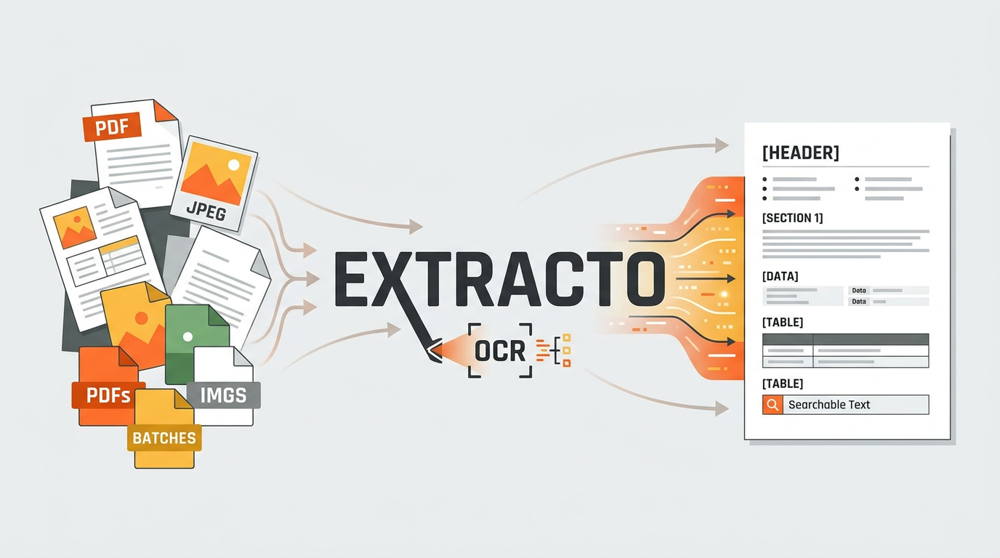
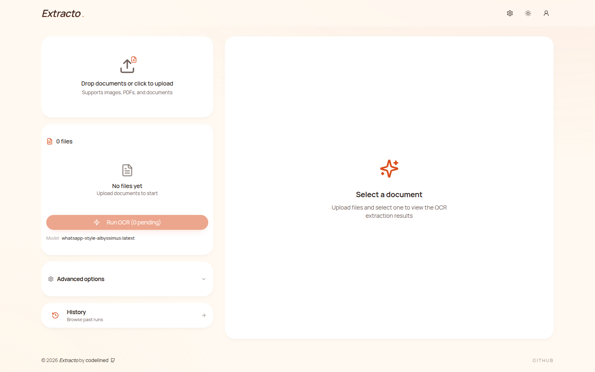

<p align="center">
  
</p>

<p align="center">
  <strong>Your private document brain.</strong><br/>
  PDFs in, RAG out. Self-hosted. Plug everywhere.
</p>

<p align="center">
  <a href="#quickstart">Quickstart</a> ·
  <a href="#what-you-get">What you get</a> ·
  <a href="#plug-everywhere">Plug everywhere</a> ·
  <a href="https://extracto.help">Docs</a> ·
  <a href="./openapi.yaml">OpenAPI</a> ·
  <a href="./CHANGELOG.md">Changelog</a>
</p>

<p align="center">
  <a href="https://github.com/codelined-ag/Extracto/actions/workflows/ci.yml"></a>
  <a href="./LICENSE"></a>
  <a href="https://github.com/codelined-ag/Extracto/pkgs/container/extracto"></a>
  <a href="https://github.com/codelined-ag/Extracto/stargazers"></a>
</p>

<p align="center">
  <picture>
    <source media="(prefers-color-scheme: dark)" srcset="docs/screenshots/main-dark.png">
    
  </picture>
</p>

> **v1.0.0**: side-by-side multi-model comparison with server-computed word-level diff, model recommendations from your own OCR history, PII auto-redaction with audit trail, form-field extraction, LaTeX equation extraction, and an E2E encryption scaffold (RSA SPKI public-key registration + AES-256-GCM envelope). v1.0 is the end of the roadmap; see the [changelog](./CHANGELOG.md).

---

## Why

Most document-to-AI tools are SaaS. They cost per page, they see your documents, they lock you into one provider. Extracto is the opposite: one Docker container, your machine, any vision model (local or hosted), output goes wherever you want it. Browser, code, agent, vector store. You pick.

---

## What you get

A complete pipeline from raw document to retrievable knowledge, in one container:

1. **Ingest** any PDF, image, or watched folder.
2. **Extract** with the vision model of your choice (Ollama, Mistral OCR, OpenRouter, any OpenAI-compatible endpoint).
3. **Post-process** with a second LLM pass (clean to markdown or strict JSON, with your own instruction).
4. **Chunk + embed + store** into Chroma, Qdrant, Weaviate, Milvus, OpenSearch, Pinecone, or Typesense.
5. **Retrieve** through a stable v1 REST API, an OpenAI-Chat-Completions adapter, an MCP server, a typed CLI, or the browser UI.

Everything else (per-user accounts, scoped API keys, rate limits, signed webhooks, S3/MinIO offload, Prometheus metrics, multi-language UI) is documented at [extracto.help](https://extracto.help).

---

## Quickstart

You need Docker. That's it.

```bash
curl -fsSL https://extracto.help/install.sh | bash
```

Pulls the prebuilt multi-arch image, runs a single container with an auto-generated `AUTH_SECRET` and a persistent SQLite volume, waits for the healthcheck, and prints the URL. Open <http://localhost:3000>, sign up, follow the tour.

For the full install (compose stack, Docker + Ollama provisioning, `extracto` CLI on PATH, Windows path), see [extracto.help/install](https://extracto.help/install).

---

## Plug everywhere

Same backend, five surfaces. Pick what fits.

| Surface | Use it when | Read |
|---|---|---|
| **Browser UI** | You're a human with a stack of PDFs | [How it works](https://extracto.help/how-it-works) |
| **REST API** (`/api/v1/*`) | You're building a document-intake pipeline | [API reference](https://extracto.help/api/overview) |
| **MCP server** | Your agent speaks MCP (Claude Desktop, Cursor, Codex, OpenClaw, Hermes) | [Agents](https://extracto.help/agents/overview) |
| **CLI + [`SKILL.md`](./SKILL.md)** | Your agent only has a shell tool | [Skill file](./SKILL.md) |
| **OpenAI-Chat adapter** | You already have OpenAI-SDK code; point it at Extracto | [OpenAI compat](https://extracto.help/api/openai-compat) |

OpenAPI 3.1 spec at [`openapi.yaml`](./openapi.yaml). Live Scalar reference at `/api/v1/docs` on every running instance.

---

## Star history

<a href="https://star-history.com/#codelined-ag/Extracto&Date">
  
</a>

---

## License

[MIT](./LICENSE) © codelined
